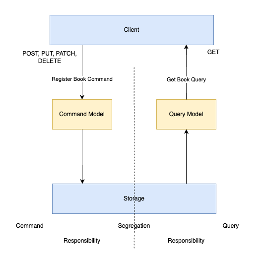

# Example of Event Sourcing with NestJS

## Introduction

Modern software systems often face the challenge of managing data consistently while ensuring a high level of scalability and traceability. Two architectural patterns that can help with this are event sourcing and CQRS (Command Query Responsibility Segregation).

## Event Sourcing (ES)

Event sourcing is an architectural principle in which the status of a system is not stored in the form of current data, but as a sequence of events. Every change is logged as an immutable event so that the entire history of a system can be traced at any time.

An example from a library system:

- BookRegistered → A new book is added to the system.
- BookBorrowed → A reader borrows a book.
- BookReturned → A book is returned.
- BookDamaged → A book is marked as damaged.
- BookRepaired → A damaged book has been repaired.
- BookRemoved → The book is removed from the system (loss or non-repairable).

Each of these events describes a change in the system. To determine the current status of a book, all relevant events are applied in the order in which they occur.


## Command Query Responsibility Segregation (CQRS)

Command Query Responsibility Segregation is an architectural pattern in which the processing of commands and queries is separated. Commands are change requests that change the state of the system, while queries retrieve information from the system without changing the state.



### Projections

A Projection is the read model built from events.
It represents the current state of something, derived by processing a stream of historical events.

- Think of it like a materialized view of your data.
- It is not stored in the event store (which only stores events). It can be an extra table in the same database as the events, but also a completely separate storage (SQL, NoSQL, Elasticsearch, Redis etc.) that is optimized for fast queries

Projections are rebuildable at any time by replaying the event stream.


## Installation

```bash
$ pnpm install
```

## Running the app

```bash
# development
$ pnpm run start

# watch mode
$ pnpm run start:dev

# production mode
$ pnpm run start:prod
```

## Test

```bash
# unit tests
$ pnpm run test

# e2e tests
$ pnpm run test:e2e

# test coverage
$ pnpm run test:cov
```


